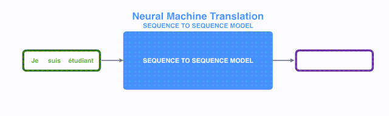

# Attention

- 问题：Attention出现的原因是什么？
- 潜在的答案：基于循环神经网络（RNN）一类的seq2seq模型，在处理**长文本时遇到了挑战**，而对长文本中不同位置的信息进行**attention有助于提升RNN的模型效果**。

于是学习的问题就拆解为：

1. 什么是**seq2seq**模型？
2. 基于RNN的seq2seq模型如何处理**文本/长文本**序列？
3. seq2seq模型处理长文本序列时遇到了**什么问题**？
4. 基于RNN的seq2seq模型如何**结合attention**来改善模型效果？

## seq2seq

seq2seq是一种常见的NLP模型结构，全称是：sequence to sequence，翻译为“序列到序列”。顾名思义：从一个文本序列得到一个新的文本序列。典型的任务有：机器翻译任务，文本摘要任务。

## **seq2seq干了什么事情？**

seq2seq模型的

- **输入**可以是一个（单词、字母或者图像特征）序列

- **输出**是另外一个（单词、字母或者图像特征）序列

一个训练好的seq2seq模型如下图所示：

如下图所示，以NLP中的机器翻译任务为例，序列指的是一连串的单词，输出也是一连串单词。

### seq2seq细节

将上图中**蓝色**的seq2seq模型进行**拆解**，如下图所示：seq2seq模型由==编码器（Encoder）==和==解码器（Decoder）==组成。

**绿色的编码器**会处理输入序列中的每个元素并获得输入信息，这些信息会被转换成为一个黄色的向量（称为==context向量==）。

当我们处理完整个输入序列后，编码器把 context向量 发送给**紫色的解码器**，解码器通过context向量中的信息，逐个元素输出新的序列。

由于seq2seq模型可以用来解决**机器翻译**任务，因此机器翻译被任务seq2seq模型解决过程如下图所示，当作seq2seq模型的一个具体例子来学习。

深入学习机器翻译任务中的seq2seq模型，如下图所示。seq2seq模型中的编码器和解码器一般采用的是循环神经网络RNN（Transformer模型还没出现的过去时代）。编码器将输入的法语单词序列编码成context向量（在绿色encoder和紫色decoder中间出现），然后解码器根据context向量解码出英语单词序列。

图：context向量对应上图中间**浮点数向量**。在下文中，我们会可视化这些数字向量，使用更明亮的色彩来表示更高的值，如上图右边所示

如上图所示，我们来看一下黄色的context向量是什么？

本质上是一组浮点数。而这个**context的数组长度是基于编码器RNN的隐藏层神经元数量**的。上图展示了长度为4的context向量，但在实际应用中，**context向量的长度是自定义的**，比如可能是256，512或者1024。

## 那么RNN是如何具体地处理输入序列的呢？

1. 假设序列输入是一个**句子**，这个句子可以由$n$个**词**表示：$sentence = \{w_1, w_2,...,w_n\}$。
2. RNN首先将句子中的每一个**词**映射成为一个向量得到一个**向量序列**：$X = \{x_1, x_2,...,x_n\}$，每个单词映射得到的向量通常又叫做：==word embedding==。
3. 然后在处理第$t \in [1,n]$个**时间步**的序列输入$x_t$时，RNN网络的输入和输出可以表示为：$h_{t} = RNN(x_t, h_{t-1})$

   - 输入：RNN在**时间步**$t$的输入之一为单词$w_t$经过映射得到的向量$x_t$。
   - 输入：RNN另一个输入为**上一个时间步**$t-1$得到的hidden state向量$h_{t-1}$，同样是一个向量。
   - 输出：RNN在时间步$t$的输出为$h_t$ ==hidden state向量==。

图：word embedding例子。我们在处理单词之前，需要将单词映射成为向量，通常使用 word embedding 算法来完成。一般来说，我们可以使用提前训练好的 word embeddings，或者在自有的数据集上训练word embedding。为了简单起见，上图展示的word embedding维度是4。上图左边每个单词经过word embedding算法之后得到中间一个对应的4维的向量。

进一步可视化一下基于RNN的seq2seq模型中的编码器在第1个时间步是如何工作：

动态图：如图所示，RNN在第2个时间步，采用第1个时间步得到hidden state#10（隐藏层状态）和第2个时间步的输入向量input#1，来得到新的输出hidden state#1。

看下面的动态图，让我们详细观察一下编码器如何在**每个时间步**得到hidden sate，并将最终的hidden state传输给解码器，解码器根据编码器所给予的最后一个hidden state信息解码处输出序列。注意，**最后一个 hidden state实际上是我们上文提到的context向量**。

动态图：编码器逐步得到hidden state并传输最后一个hidden state给解码器。

接着，结合编码器处理输入序列，一起来看下**解码器如何一步步得到输出序列的**。

与编码器类似，解码器在每个时间步也会得到 hidden state（隐藏层状态），而且也需要把 hidden state（隐藏层状态）从一个时间步传递到下一个时间步。

动态图：**编码器**首先**按照时间步依次编码**每个法语单词，最终将最后一个hidden state也就是context向量传递给解码器，**解码器**根据**context向量逐步解码**得到英文输出。

## seq2seq模型处理文本序列（特别是长文本序列）时会遇到什么问题？

基于RNN的seq2seq模型编码器**所有信息都编码到了一个context向量中**，便是这类模型的瓶颈。

- 一方面**单个向量**很**难包含所有文本序列**的信息
- 另一方面RNN递归地编码文本序列使得模型在处理**长文本时面临非常大的挑战**（比如RNN处理到第500个单词的时候，很难再包含1-499个单词中的所有信息了）。

## 基于RNN的seq2seq模型如何结合attention来改善模型效果？

面对以上问题，Bahdanau等2014发布的[Neural Machine Translation by Jointly Learning to Align and Translate](https://arxiv.org/abs/1409.0473) 和 Luong等2015年发布的[Effective Approaches to Attention-based Neural Machine Translation
](https://arxiv.org/abs/1508.04025)两篇论文中，提出了一种叫做注意力**attetion**的技术。通过attention技术，seq2seq模型极大地提高了机器翻译的质量。

归其原因是：attention注意力机制，使得seq2seq模型可以**有区分度、有重点地关注输入序列**。

下图依旧是机器翻译的例子：

图：在第 7 个时间步，注意力机制使得解码器在产生英语翻译student英文翻译之前，可以将注意力集中在法语输入序列的：étudiant。这种有区分度得attention到输入序列的重要信息，使得模型有更好的效果。

让我们继续来理解带**有注意力的seq2seq模型**：一个注意力模型与经典的seq2seq模型主要有**2点不同**：

1. 首先，编码器会把**更多的数据**传递给解码器。编码器把所有时间步的 hidden state（隐藏层状态）传递给解码器，而**不是只传递最后一个 hidden state**（隐藏层状态），如下面的动态图所示:

   

2. 注意力模型的**解码器在产生输出之前**，做了一个额外的**attention处理**。如下图所示，具体为：

   1. 由于编码器中每个 hidden state（隐藏层状态）都对应到输入句子中一个单词，那么解码器要查看所有接收到的编码器的 hidden state（隐藏层状态）。

   2. 给每个 hidden state（隐藏层状态）**计算出一个分数**（我们先忽略这个分数的计算过程）。

   3. 所有hidden state（隐藏层状态）的分数经过**softmax进行归一化**。

   4. 将**每个 hidden state（隐藏层状态）乘以所对应的分数**，从而能够让**高分**对应的  hidden state（隐藏层状态）会被**放大**，而**低分**对应的  hidden state（隐藏层状态）会被**缩小**。

   5. 将所有hidden state根据对应分数进行**加权求和**，得到对应时间步的context向量。

      

所以，**attention可以简单理解为：一种有==效的加权==求和技术，其艺术在于如何获得权重**。

现在，让我们把所有内容都融合到下面的图中，来看看**结合注意力的seq2seq模型解码器**全流程，动态图展示的是第4个时间步：

1. 注意力模型的解码器 RNN 的输入包括：
   - 一个word embedding 向量
   - 一个初始化好的解码器 hidden state，图中是$h_{init}$。
2. RNN 处理上述的 2 个输入，产生一个输出和一个新的 **hidden state**，图中为**h4**。
3. 注意力的步骤：我们使用编码器的**所有 hidden state向量和 h4 向量**来计算这个时间步的**context向量（C4）**。
4. 我们把 **h4 和 C4 拼接起来**，得到一个橙色向量。
5. 我们把这个橙色向量输入一个前馈神经网络（这个网络是和整个模型一起训练的）。
6. 根据前馈神经网络的输出向量得到输出单词：假设输出序列可能的单词有N个，那么这个前馈神经网络的输出向量通常是N维的，每个维度的下标对应一个输出单词，每个维度的数值对应的是该单词的输出概率。
7. 在下一个时间步重复1-6步骤。

动态图：解码器结合attention全过程

## 可视化注意力

最后，我们可视化一下注意力机制，看看在解码器在每个时间步关注了输入序列的哪些部分：

动态图：解码步骤时候attention关注的词

需要注意的是：注意力模型不是无意识地把输出的第一个单词对应到输入的第一个单词，它是在训练阶段**学习到如何对两种语言的单词进行对应**（在我们的例子中，是法语和英语）。

下图还展示了注意力机制的准确程度（图片来自于上面提到的论文）：

图：可以看到模型在输出 "European Economic Area" 时，注意力分布情况。在法语中，这些单词的顺序，相对于英语，是颠倒的（"européenne économique zone"）。而其他词的顺序是类似的。

## 致谢

主要由哈尔滨工业大学张贤同学翻译（经原作者 [@JayAlammmar](https://twitter.com/JayAlammar) 授权）撰写，由多多同学、datawhale学习者重新组织和整理。

本人在原文基础上根据自己的理解进行了部分排版

# Transformer

在学习完[图解attention](./2.1-图解attention.md)后，我们知晓了attention为循环神经网络带来的优点。那么有没有一种神经网络结构**直接基于attention构造**，并且**不再依赖RNN、LSTM或者CNN网络结构**了呢？

答案便是：**Transformer**。因此，我们将在本小节对Transformer所涉及的细节进行深入探讨。

Transformer模型在2017年被google提出，直接基于Self-Attention结构，取代了之前NLP任务中常用的RNN神经网络结构，并在WMT2014 Englishto-German和WMT2014 English-to-French两个机器翻译任务上都取得了当时的SOTA。

与RNN这类神经网络结构相比，Transformer一个**巨大的优点**是：模型在处理序列输入时，可以对**整个序列输入**进行**并行计算**，不需要按照时间步循环递归处理输入序列。

下图先便是Transformer整体结构图，与上节中介绍的seq2seq模型类似，Transformer模型结构中的左半部分为编码器（encoder），右半部分为解码器（decoder），下面我们来一步步拆解 Transformer。

图：transformer模型结构

注释和引用说明：本文将通过总-分的方式对Transformer进行拆解和讲解，希望有助于帮助初学者理解Transformer模型结构。本文主要参考[illustrated-transformer](http://jalammar.github.io/illustrated-transformer)。

## Transformer宏观结构

Transformer最开始提出来解决机器翻译任务，因此可以看作是seq2seq模型的一种。

本小节先抛开Transformer模型中结构具体细节，先从**seq2seq的角度**对**Transformer进行宏观结构**的学习。

以机器翻译任务为例，先将Transformer这种特殊的seqseq模型看作一个黑盒，黑盒的**输入**是法语文本序列，**输出**是英语文本序列（对比2.1章节的seq2seq框架知识我们可以发现，Transformer宏观结构属于seq2seq范畴，只是将之前seq2seq中的编码器和解码器，从RNN模型替换成了Transformer模型）。

图：Transformer黑盒输入和输出

将上图中的中间部分**“THE TRANSFORMER”**拆开成seq2seq标准结构，得到下图：

- 左边是编码部分encoders
- 右边是解码器部分decoders。

图：encoder-decoder

下面，再将上图中的编码器和解码器细节绘出，得到下图。

- 我们可以看到，**编码部分（encoders）**由多层编码器(Encoder)组成（Transformer论文中使用的是6层编码器，这里的**层数6并不是固定的**，你也可以根据实验效果来修改层数）。

- 同理，**解码部分（decoders）**也是由多层的解码器(Decoder)组成（论文里也使用了6层解码器）。每层编码器网络结构是一样的，每层解码器网络结构也是一样的。**不同层编码器和解码器网络结构不共享参数**。

图：6层编码和6层解码器

接下来，我们看一下**单层encoder**，单层encoder主要由以下两部分组成，如下图所示

- Self-Attention Layer
- Feed Forward Neural Network（前馈神经网络，缩写为 FFNN）

编码器的输入文本序列$w_1, w_2,...,w_n$最开始需要经过embedding转换，得到每个单词的向量表示$x_1, x_2,...,x_n$，其中$x_i \in \mathbb{R}^{d}$是维度为$d$的向量，然后所有向量经过一个Self-Attention神经网络层进行变换和信息交互得到$h_1, h_2,...h_n$，其中$h_i \in \mathbb{R}^{d}$是维度为$d$的向量。

**self-attention层**处理一个**词向量**的时候，不仅会使用这个**词本身的信息**，也会使用**句子中其他词的信息**（你可以类比为：当我们翻译一个词的时候，不仅会只关注当前的词，也会关注这个词的**上下文的其他词的信息**）。Self-Attention层的输出会经过前馈神经网络得到新的$x_1, x_2,..,x_n$，依旧是$n$个维度为$d$的向量。这些向量将被送入下一层encoder，继续相同的操作。

图：单层encoder

与编码器对应，如下图，**解码器**在编码器的self-attention和FFNN中间插入了一个**Encoder-Decoder Attention层**，这个层帮助解码器**聚焦于输入序列最相关的部分**（类似于seq2seq模型中的 Attention）。

图：单层decoder

**总结一下**，我们基本了解了Transformer由

- 编码部分
  - 多个网络结构相同的编码层
    - self-attention
    - FFNN

- 解码部分
  - 多个网络结构相同的解码层
    - self-attention
    - FFN
    - encoder-decoder attention。

以上便是Transformer的宏观结构啦，下面我们开始看宏观结构中的模型细节。

## Transformer结构细节

下面，让我们来看看Transformer如何将**输入文本序列**转换为**向量**表示，又如何逐层处理这些向量表示得到最终的**输出**。

### 输入处理

#### 词向量

和常见的NLP 任务一样，我们首先会使用**词嵌入算法**（embedding algorithm），将输入文本序列的每个词转换为一个词向量。实际应用中的向量一般是 256 或者 512 维。但为了简化起见，我们这里使用4维的词向量来进行讲解。

如下图所示，假设我们的输入文本是序列包含了3个词，那么每个词可以通过词嵌入算法得到一个4维向量，于是整个输入被转化成为一个向量序列。

在实际应用中，我们通常会**同时给模型输入多个句子**，如果每个句子的长度不一样，我们会选择一个合适的长度，作为**输入文本序列的最大长度**：如果一个句子达不到这个长度，那么就填充先填充一个特殊的“padding”词；如果句子超出这个长度，则做截断。

图：3个词和对应的词向量

==最大序列长度==是一个超参数，通常希望越大越好，但是更长的序列往往会占用更大的训练显存/内存，因此需要在模型训练时候视情况进行决定。

输入序列每个单词被转换成词向量表示还将加上**位置向量**来得到该词的**最终向量**表示。

#### 位置向量

如下图所示，Transformer模型对每个**输入**的**词向量**都**加上**了一个**位置向量**。

这些向量有助于确定每个单词的**位置特征**，或者句子中不同单词之间的**距离特征**。词向量加上位置向量背后的直觉是：将这些表示位置的向量添加到词向量中，得到的新向量，可以为模型提供更多有意义的信息，比如**词的位置，词之间的距离**等。

图：位置编码向量

依旧假设词向量和位置向量的维度是4，我们在下图中展示一种可能的位置向量+词向量：

图：位置编码向量

那么带有位置编码信息的向量到底遵循什么模式？原始论文中给出的设计表达式为：
$$
PE_{(pos,2i)} = sin(pos / 10000^{2i/d_{\text{model}}}) \\                                                                       PE_{(pos,2i+1)} = cos(pos / 10000^{2i/d_{\text{model}}})
$$
上面表达式中的$pos$代表词的位置，$d_{model}$代表位置向量的维度，$i \in [0, d_{model})$代表位置$d_{model}$维位置向量第$i$维。

于是根据上述公式，我们可以得到第$pos$位置的$d_{model}$维位置向量。在下图中，我们画出了一种位置向量在第4、5、6、7维度、不同位置的的数值大小。横坐标表示位置下标，纵坐标表示数值大小。

图：位置编码在0-100位置，在4、5、6、7维的数值图示

当然，上述公式不是唯一生成位置编码向量的方法。但这种方法的优点是：可以扩展到未知的序列长度。例如：当我们的模型需要翻译一个句子，而这个句子的长度大于训练集中所有句子的长度，这时，这种位置编码的方法也可以生成一样长的位置编码向量。
